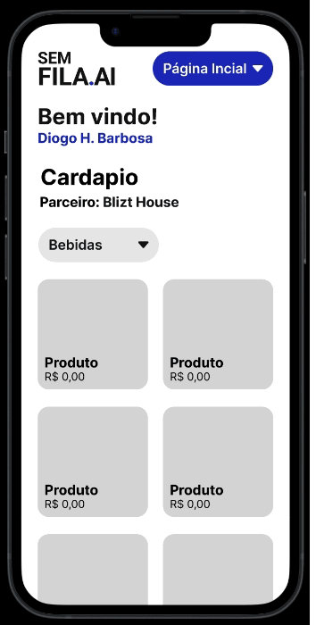

# Semfila.ai

Para o projeto integrador do 3º Semetre do curso de Desenvolvimento de Solfware Multiplataforma tem como o obj. facilitar e destravar um gargalo, pagamento da sua comanda e a realização dos seus pedidos;

## Mobile

    

## Projeto

Pensando nisso estamos construindo o [Semfila.ai](http://Semfila.ai '‌'), onde o User. quando chegar no nosso estabelecimento parceiro, poderá acessar nosso sistema, onde poderá ver os produtos ali disponível, realizar o pedido pela plataforma, junto o pagamento;

O foco inicial será nessa parte, onde vamos construir um MVP, onde como User. poderei acessar o cardápio virtual do parceiro, realizar o pedido do produto, o qual será acrescentado na sua comanda, finalizando a comanda, o cliente terá a possibilidade de realizar o pagamento pelo sistema;

Com base nisso devemos construir e pensar:

- Requisito Funcionais
- Requisitos não funcionais

## Objetivos

Construir a documentação do projeto, onde devemos como o objetivo principal é:

- **A2 - Metodologia Ágil**
  - Aumentar a satisfação do cliente (escolher um segmento de empresa) - o qual devemos escolher uma das metodologias para chegar em nossos objetivos Scrum, Kanban ou Desing thinking.
- **A2 - IHC**
  - Métricas de Usabilidade
    - Tempo de resposta
    - Taxa de sucesso
    - Tempo de aprendizado
    - Satisfação do usuário
    - Taxa de erro
    - Nível de consciência
    - Tempo de tarefa
    - Compreensão

  - Realizar o estudo/elaborar avaliações Heurísticas do nosso sistema.
    - Avaliação do design de acordo com as heurísticas de Nielsen.
  - Inspeção Semiótica
    - Desenvolver um signo visual para o Projeto
- **A2 - Desenvolvimento Web ll**
  - Construir um aplicação web da ideia do projeto

---

## Avaliação Heurísticas do sistema

### O que são as Heurísticas de Nielsen?

Se formos ao dicionário e buscarmos por heurística, encontramos o ponto principal que são descobertas, mas pedagogicamente, formas de fazer com que o aluno descubra algo por meio de perguntas. Sendo assim, podemos dizer que as heurísticas de Nielsen são hipóteses que precisam ser validadas para garantir que o design atenderá às necessidades e expectativas do projeto.

Em outras palavras, as heurísticas de Nielsen são uma forma de avaliar o design de interface, identificando falhas e erros para corrigi-los e otimizar a user experience, ou experiência do usuário.

#### Como foi avaliado o sistema?

 Nesta etapa avaliamos, determinando o objetivo do teste e selecionando as tarefas há serem feitas. Escolhemos os voluntários para o teste, e no final do teste entrevistamos os usuários, a fim de saber suas experiências com a aplicação.

> **Tarefas**:
>
> - Realizar a login/entrada
>   - QR Code
>   - Cpf/Tel
> - Visualizar cárdapio
>   - Realizar o pedido
> - Fechar Comanda
>   - Pagamento
>

Escolhemos 2 pessoas entre 20 à 25 anos, que vão sempre em restaurantes e bares. Qual fizemos as seguindes perguntas sobre o layout, obtivemos as seguintes respostas.

### 1 - Persona

Andre de 22 anos, morador da Grande São paulo, gosta de ir em bares e restaurante todos os finais de semanas e feriados.

**Achou fácil mexer no aplicativo?**

> Sim, gostei muito das cores, elas ajudam a reconhecer bem os icones e áreas de acesso do aplicativo, ainda mais quando se quer ir embora logo.
>

**Achou intuitivo?**

> Achei, pois assim que entrei ja aparece tudo logo na primeira pagina, não há como se perder.
>

**Algo a melhorar?**

> Acredito que quanto mais restaurantes aceitarem, será melhor.
>

### 2 - Persona

Barbara, 24, costuma ir na balada todo fim de semana.

**Achou fácil mexer no aplicativo?**

> Achei, pois mexo muito em celular, e não senti nenhuma dificuldade

**Achou intuitivo?**

> Sim, estava tudo claro, bem explicado

**Algo a melhorar?**

> Acredito que não

---

## Inspeção semiotica

### Logo

    

A logo tem o objeivo de ser simples, direta e minimalista, ao colocar apenas o nome da aplicação, temos o foco em apresentar logo de cara o que software propõe. O ".ai" serve como trocadilho para soar algo como "Sem fila ai", reforçando que o objetivo da aplicação é eliminar a demora de uma fila, além de mostrar também que é um serviço tecnológico sofisticado.

### Referencias

<https://rockcontent.com/br/blog/heuristicas-de-nielsen/>
